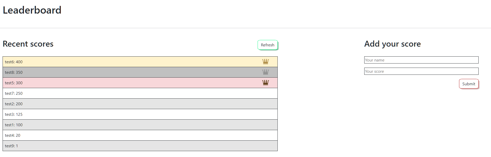

# Leaderboard

> On this project I create a leaderboard using an external API.

On this milestone I added styling to the project as well as made it responsive and added some QoL like the refresh button showing if it's dones or currently refreshing.

## Built With

- HTML
- CSS
- JS
- Webpack
- Fetch API
## Get Started

- Clone the repository with git clone https://github.com/leolpaz/Leaderboard.git;
- Install dependencies with npm i;
- Change the mode on webpack.config.js from 'production' to 'development'
- Use npm start to start the website;

## Authors

👤 **Leonardo Paz**

- Github: [Leonardo Paz](https://github.com/leolpaz)
- Twitter: [Leonardo Paz](https://twitter.com/leonardolpaz95)
- Linkedin: [Leonardo Paz](https://www.linkedin.com/in/leonardo-paz-a925611b5/)

## 🤝 Contributing

Contributions, issues, and feature requests are welcome!

Feel free to check the [issues page](../../issues/).

## Show your support

Give a ⭐️ if you like this project!

## Acknowledgments

- Microverse

## 📝 License

This project is [MIT](./MIT.md) licensed.
